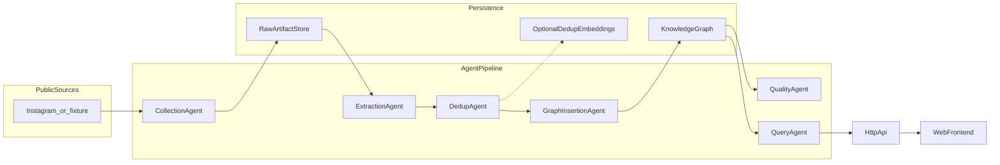
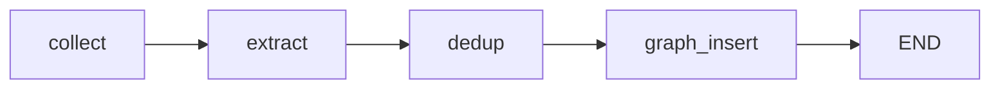
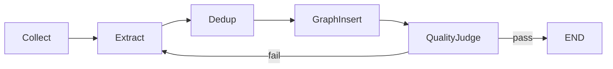
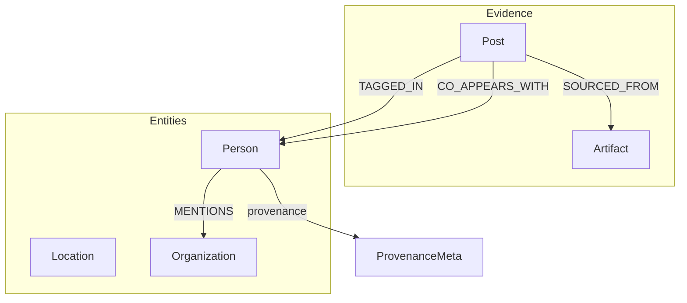

# Instagram OSINT Knowledge Graph Agent — Architecture

This document describes the plan, technology choices, and system architecture for a **six-agent pipeline** that collects publicly available Instagram-related data, extracts **named entities and relationships**, **deduplicates** candidates using **fuzzy string matching** and **semantic embeddings**, persists a **knowledge graph** with **full provenance**, and answers **natural language** questions **grounded** in the stored graph (for example: who appeared together most often).

**Engineering standards** (clean code, SOLID, concurrency/serving, and a **read-before-run** checklist): [requirement.md](requirement.md).

---

## 1. Vision and scope

### Goals

- Provide a teaching-oriented **multi-agent pipeline** with clear stage boundaries: **collection → extraction → deduplication → graph insertion → quality checking → query answering**.
- Produce a **queryable knowledge graph** where every substantive assertion can be traced to **sources and pipeline metadata** (provenance).
- Support **natural language queries** whose answers cite **graph evidence** (nodes, edges, or provenance references), not unconstrained hallucination.

### Non-goals and boundaries

- **No private or non-public data.** Do not target private accounts, DMs, or data that requires impersonation or bypassing access controls.
- **No credential stuffing,** session hijacking, or circumvention of platform security.
- **Respect platform terms,** rate limits, and applicable law. **Collection** MUST use lawful, policy-compliant methods (official APIs where available) or **instructor-approved fixtures** for labs and CI.
- This architecture does not prescribe scraping techniques; any real-world adapter MUST be vetted for compliance **before** use in production or classroom deployments.

### Graph RAG versus vector RAG

**Vector RAG** retrieves unstructured chunks by embedding similarity. It is strong for local “what did a post say about X?” style recall, but weak for **global relational questions** (for example: which pair of people **co-appeared most often** across many posts), because those answers require **aggregation and joins** over a population of entities and edges.

**Graph RAG** (as used here) treats the **knowledge graph as the retriever**: the query agent turns a question into a **bounded, read-only** graph pattern or **Cypher** query, executes it, and may only justify the answer from **rows / paths returned** plus **provenance** on nodes and relationships. **Embeddings are not used at query time** in this design; they may support **deduplication** (Phase 3) or optional future candidate generation, but the authoritative evidence is always **graph structure + properties**.

**Primary bottleneck:** for Instagram-style OSINT, the limiting factor is usually **data collection** (rate limits, anti-automation, CAPTCHAs, DOM and API churn), not model quality. The pipeline is designed so **fixtures and adapters** keep development and CI stable while optional live collectors are policy-reviewed.

---

## 2. System context

**Actors:** **web frontend** (primary), human operators, optional **scheduler** or job runner for batch ingest.

**External systems:** public Instagram surface (or **fixture files** substituting for production collection).

**Delivery surfaces (important):**

- **HTTP API (primary):** The product-facing contract is a **backend API** (REST/JSON over HTTP or equivalent) that the **frontend** calls. Pipeline stages, graph reads, and Graph RAG answers are exposed as **resources and operations** behind that API—not as a CLI workflow. The API layer is **not implemented yet**; this document assumes it will own authentication, request validation, and stable response shapes for the UI.
- **CLI (secondary):** A small `python -m …` command is useful for **local smoke tests**, **CI**, and operator scripts only. **Do not center the architecture on the CLI**; treat it as a thin wrapper around the same **application services** the API will call later.

**Internal:** agent pipeline (orchestration via **LangGraph** once implemented), **raw artifact store**, **knowledge graph**, and optional **embedding signals for deduplication only**. Query answering is graph-native GraphRAG, not embedding retrieval at answer time.

**Repository layout (implementation):** shared configuration and schemas live at the **`src/`** package root; each pipeline **agent** is implemented under **`src/agents/<stage>/`** (for example `agents.collection`) so the tree stays shallow at the top but still one bounded folder per stage.

**Orchestration default (target):** **LangGraph** models the pipeline as a **state machine** with typed state, which is the right shape for future **conditional routing** (for example, send failed quality checks back to extraction). **CrewAI** is a reasonable higher-level alternative when role-based agents are enough and you need less explicit control over edges. After **Phase 0** in this repository, orchestration code is **not** checked in yet; reintroduce LangGraph when Phases 1–4 are wired again.

### 2.1 Logical dataflow (all six agents)

### 2.2 Planned LangGraph wiring (repository)

When orchestration is added back, the repo uses **one** compiled **`StateGraph`** (single LangGraph app) that grows in two steps: (1) **Phase 4** — linear **collect → extract → dedup → graph_insert**; (2) **Phase 5** — add **`quality`** and **conditional loop-back** edges on the **same** graph and shared state types ([phases/04_graph_insertion.md](phases/04_graph_insertion.md), [phases/05_quality_checking.md](phases/05_quality_checking.md)). **Phase 6 QueryAgent** is **not** part of this graph by default — it answers **per HTTP request** from the API (see §2.4).

### 2.3 Target control flow (quality loop, same LangGraph)

Once Phase 5 exists, **extend the same `StateGraph` from §2.2** so validation can **re-enter** earlier ingest nodes when an **LLM-as-a-judge** or rule pack rejects a batch. Ingest is still triggered by **API jobs** or workers—not “CLI-only” behavior.

**Phase 6** (natural-language **Query** / Graph RAG) is **outside** this diagram: the **HTTP API** calls **QueryAgent** per user question; it does **not** add a second LangGraph in the default design (§2.4).

### 2.4 Single LangGraph policy (default)

| Topic | Decision |
|-------|-----------|
| **How many LangGraph apps?** | **One** — a single compiled graph in `agents/pipeline/` (or equivalent), versioned and tested together. |
| **What it covers** | **Ingest + quality** — Phases **4–5** on the same `StateGraph` and shared typed state. |
| **What it does not cover (default)** | **Phase 6 QueryAgent** — request/response path under the **HTTP API** (optionally a *tiny* internal chain for NL→verify→execute is fine as plain Python or a *sub*-graph module, but **not** a separate second “main” LangGraph product). |
| **Why** | Avoids two orchestration sources of truth, duplicated state schemas, and split debugging for the batch pipeline vs online Q&amp;A. |

---

## 3. Six-agent pipeline

Each agent owns **one stage** aligned with the project idea: **collection, extraction, deduplication, graph insertion, quality checking, query answering.** Records between stages SHOULD be **versioned JSON or rows** with explicit schema fields; failures SHOULD be **logged** and, where appropriate, **quarantined** rather than silently dropped.

### 3.1 CollectionAgent

| | |
|---|---|
| **Purpose** | Ingest **publicly available** posts, captions, hashtags, timestamps, and public profile metadata from a **SourceAdapter**. |
| **Inputs** | Run configuration (time window, seed handles, max items), **run_id**, adapter credentials (outside repo). |
| **Outputs** | **RawArtifact** records: `source_url`, platform ids, raw text/HTML/JSON payloads, collected_at, **collector_version**. |
| **Provenance** | Every artifact carries **run_id**, adapter id, and collection timestamp. |
| **Failure modes** | Rate limits, auth errors, empty results → retry with backoff; persist partial runs with status. |
| **Recommended tooling** | **Static seed datasets / fixtures** are the default for CI/classroom reproducibility. For live collection in Phase 1, prefer **Apify** first: student-friendly onboarding (often no credit card), recurring **$5 free monthly credit**, and ready Instagram Actors that reduce setup burden. Keep **Instaloader** as the no-license-cost fallback when budget is strictly zero, but treat it as higher operational risk (account/IP/session management is your responsibility). |

### 3.2 ExtractionAgent

| | |
|---|---|
| **Purpose** | From raw text (captions, bios, on-image OCR if used), emit **named entities** and **relationships** (typed edges or triple-like structures). |
| **Inputs** | RawArtifactStore (by **run_id** or batch). |
| **Outputs** | **ExtractionRecord**: entities (type, surface form, offsets/snippets), relations (subject, predicate, object, confidence), **extractor_model_id**, optional char spans. |
| **Provenance** | Link each extraction to **artifact_id** + **run_id**; store model name and version. |
| **Failure modes** | Parser errors → skip artifact with reason; low confidence → flag for QualityAgent. |
| **Recommended tooling** | **Instructor** (or equivalent) + a hosted LLM (**Claude/GPT**) as the **default** for caption relationship extraction with **schema-validated JSON** output. Keep a **heuristic baseline** for CI/offline runs, and optionally merge a **GLiNER** local NER pass for span hints. Configure behavior via `.env` (`EXTRACT_MODE`, `EXTRACT_LLM_PROVIDER`, `EXTRACT_LLM_MODEL`, `UTSA_*`). |

### 3.3 DedupAgent

| | |
|---|---|
| **Purpose** | Resolve duplicate or near-duplicate **entities** and **mentions** using **fuzzy string matching** and **semantic embeddings**; emit **canonical** identifiers and merge decisions. |
| **Inputs** | ExtractionRecord batches; optional **embedding** vectors from OptionalVectorIndex or on-the-fly encoder. |
| **Outputs** | **DedupReport**: clusters, `canonical_id`, merged aliases, scores (fuzzy ratio, cosine similarity), **thresholds_used**, keep/drop rationale. |
| **Provenance** | Immutable audit log of merges (which ids collapsed, which operator/rule). |
| **Failure modes** | Ambiguous merges → human-review flag or conservative split; never merge without exceeding configured thresholds. |
| **Recommended tooling** | **RapidFuzz** for fuzzy gates; **sentence-transformers** (for example `all-MiniLM-L6-v2`) or another embedding model for semantic clustering when you want stronger “The Met” vs “Metropolitan Museum” behavior. The current reference implementation uses a **deterministic char n-gram** embedding backend for zero-ops CI; upgrading to MiniLM is an optional stretch documented in Phase 3. |

### 3.4 GraphInsertionAgent

This phase prepares the graph substrate for GraphRAG. It does not answer questions yet; it creates typed nodes, relationships, and provenance so Phase 6 can retrieve evidence by graph traversal.

| | |
|---|---|
| **Purpose** | Map deduplicated entities and relations to **graph nodes and edges**; **idempotent** upserts so replays do not duplicate structure. |
| **Inputs** | DedupReport + ExtractionRecord (for edge details). |
| **Outputs** | Graph mutations (node/edge upserts), insertion summary counts, **transaction_id** or batch id. |
| **Provenance** | Attach **source_run_id**, **snippet_hash**, **extractor_model_id**, and references to **RawArtifact** on nodes or via dedicated **Provenance** nodes/relationships. |
| **Failure modes** | Constraint violations → roll back batch, log offending record; partial success policy defined in config. |
| **Recommended tooling** | **Neo4j** (Community or **AuraDB**) with the official **`neo4j`** Python driver and **Cypher** constraints for idempotent upserts. Model provenance as properties or as explicit edges such as **SOURCED_FROM** / **EXTRACTED_FROM** to `Post` or `Artifact`. **SQLite graph-lite** is a sensible zero-ops default for early phases (`GRAPH_BACKEND` in `.env` when graph insertion lands). |

### 3.5 QualityAgent

| | |
|---|---|
| **Purpose** | Run **validation rules** and produce **metrics**; flag or quarantine inconsistent graph content. |
| **Inputs** | Knowledge graph (read-only snapshot or API), rule set version. |
| **Outputs** | **QualityReport**: orphan nodes, conflicting assertions, low-confidence clusters, degree anomalies, suggested fixes (not auto-destructive). |
| **Provenance** | Reports stored with **rule_pack_version** and timestamp. |
| **Failure modes** | Rule engine errors → fail closed on publishing “clean” downstream artifacts; **no silent delete** without explicit policy. |
| **Recommended tooling** | Deterministic **rule-based validators** first, then an **LLM judge agent** that samples nodes/edges (and backing snippets) to flag anomalies with structured reasons; **Guardrails AI** (or similar) for schema and source-url/artifact checks before publish. LangGraph should eventually **route failures** back to extraction or dedup (see §2.3). |

### 3.6 QueryAgent

| | |
|---|---|
| **Purpose** | Accept **natural language** questions; use GraphRAG over the knowledge graph: translate the question into a bounded, read-only graph query, execute it, and return answers **grounded** in graph evidence. |
| **Inputs** | User question, optional session context, graph connection, schema summary (typically from an **HTTP API** handler on behalf of the frontend). |
| **Outputs** | Natural language answer + **evidence**: node ids, edge ids, Cypher (or equivalent), result rows, provenance pointers — serialized as the **API response body** the UI consumes. |
| **Provenance** | Log **query_id**, generated query text, and result checksum. |
| **Failure modes** | Unsafe or non-readonly generated query → reject; empty results → explicit “no evidence in graph”; enforce **LIMIT** and timeouts. |
| **Recommended tooling** | **LangChain** or **LlamaIndex** text-to-Cypher pipelines (for example `GraphCypherQAChain` or equivalent), **or** a custom **Claude/GPT agent** with graph-retrieval tools; all options must pass through a **read-only Cypher verifier** and optional dual-model generate–verify safety gate. |

---

## 4. Data and provenance model

### 4.1 Core node types (illustrative)

| Kind | Examples | Typical properties |
|------|-----------|-------------------|
| **Person** | public persona, tagged user | `canonical_id`, `aliases`, `ig_handle` (if public) |
| **Organization** | brand, venue | `name`, `type` |
| **Location** | named place | `name`, normalized form |
| **Post** | Instagram post | `platform_post_id`, `url`, `posted_at` |
| **Artifact** | raw capture | `raw_payload_ref`, `collected_at` |

### 4.2 Core relationship types (illustrative)

| Relationship | Meaning |
|--------------|--------|
| **CO_APPEARS_WITH** | Co-appearance in same post/media context (supports questions like “who appeared together most often”) |
| **TAGGED_IN** | Tag or explicit mention linking Person to Post |
| **MENTIONS** | Textual mention in caption |
| **SOURCED_FROM** | Graph fact derived from Artifact / Post |

### 4.3 Provenance fields

Attach to facts (node properties or dedicated nodes/edges):

- `source_run_id` — pipeline run
- `collector_version` — collection code or adapter version
- `extractor_model` — model id and version for NER/RE
- `snippet_hash` — hash of supporting text span
- `created_at` / `ingested_at` — timestamps

---

## 5. Technology recommendations

Defaults are chosen for **student projects**: strong libraries, clear grading boundaries, swap-friendly alternatives.

| Layer | Recommendation | Rationale | Alternatives |
|-------|----------------|-----------|--------------|
| **Runtime** | Python **3.10+** | NLP, graph drivers, agents ecosystems | — |
| **Orchestration** | **LangGraph** (target; not in tree during Phase 0) | State machine, cyclic routing ready for quality loops; inspectable `PipelineState` | **CrewAI** for role-first teams; Makefile-only scripts for minimal courses |
| **Collection** | Abstract **SourceAdapter**; fixture adapter for CI + **Apify adapter for live student runs** | Reproducible in CI, low-friction live ingestion in class via free monthly credit | **Instaloader** (zero license cost, higher ops risk) or official APIs where available—all behind adapters |
| **Raw store** | **SQLite** (current) or **Parquet** under `DATA_DIR` | Simple audit trail | S3/MinIO for larger deployments |
| **LLM extraction (Phase 2 default)** | **Instructor** + hosted or campus LLM (**Claude/GPT**) | Reliable caption-level relationship extraction with strict JSON / Pydantic-aligned outputs | Heuristic rules only (no API keys) |
| **Local NER (optional assist)** | **GLiNER** or **spaCy** | Lower cost, offline entity spans that can be merged into LLM extraction prompts/results | LLM-only extraction |
| **Dedup — fuzzy** | **RapidFuzz** | Fast string similarity | `thefuzz` (legacy) |
| **Dedup — semantic (stretch)** | **sentence-transformers** (`all-MiniLM-L6-v2` or similar) or embedding APIs | Strong semantic dedup | **Char n-gram** deterministic vectors (current default in code for CI) |
| **Graph — primary** | **Neo4j** + **neo4j** driver; **AuraDB** for managed hosting | Cypher, constraints, provenance on relationships | — |
| **Graph — lite** | **SQLite** tables for nodes/relationships (`GRAPH_BACKEND=sqlite_lite`) | Zero-ops graph for milestones and tests | Export to Neo4j later (`GRAPH_BACKEND=neo4j` when implemented) |
| **Quality (stretch)** | **Guardrails AI** + rules | Enforce “every fact has a source URL / artifact ref” | Rules only |
| **NL query** | Schema + **LLM** → read-only **Cypher** + **verifier**; optional **LangChain** graph QA chain | GraphRAG retriever is the graph; same safety story with a standard chain | Templates without LLM |
| **Packaging** | **`pyproject.toml`**, pinned deps, **`.env.example`** | Reproducible builds; model endpoints via env | — |

**Query path:** Generate a candidate query from the graph schema and neighborhood structure → **validate** (read-only, bounded) → execute → answer ONLY from tabular results + cite **node/edge/provenance** ids in the response envelope.

GraphRAG here means the knowledge graph itself is the retrieval layer. The query agent expands the question into graph patterns or Cypher, retrieves a relevant subgraph by traversal, and synthesizes the final answer only from that returned evidence.

### 5.1 Local versus API language models

**Both** are valid; configuration is **`.env`-driven** (see [`.env.example`](.env.example)):

- **Campus or commercial APIs (default for Phase 2 extraction):** call a hosted LLM endpoint for caption relationship extraction (for example GPT or Claude, including OpenAI-compatible gateways such as `UTSA_LLAMA_*` and `UTSA_QWEN_*`). Use these for **Instructor-style** extraction, **LLM-as-a-judge**, and **Cypher** drafting when keys and network are available.
- **Local / privacy-first:** **GLiNER**, **sentence-transformers**, and rule-first extraction reduce external calls; GraphRAG **query** still needs either a **local LLM** for NL→Cypher or a **template/query library** if you forbid LLMs entirely in demos.

No secrets belong in the repo; only **`NEO4J_*`**, **`UTSA_*`**, `EXTRACT_MODE`, `EXTRACT_LLM_PROVIDER`, `EXTRACT_LLM_MODEL`, `GRAPH_BACKEND`, and related knobs in `.env`.

### 5.2 Implementation paths (recommended teaching order)

| Path | Order | When to use |
|------|--------|-------------|
| **A — Graph-first proof** | Define **Neo4j schema** (constraints, key properties) → **seed** a tiny synthetic graph (or import one fixture batch) → build **QueryAgent** with read-only Cypher + verifier → demo **GraphRAG** answers | De-risks Phase 6 and the course story before fighting Instagram collection |
| **B — Forward pipeline** | Phases **0→1→2→3→4** on **fixtures**, then **LangGraph** linear ingest (`collect → extract → dedup → graph_insert`) per [phases/04_graph_insertion.md](phases/04_graph_insertion.md), driven by **API-triggered jobs** or a worker; optional **CLI** mirrors those calls for local smoke tests | Primary control plane is the **API**, not the shell |

Path A and Path B **share** the same phase documents; Path A is a **milestone reordering** for instructors, not a rename of phase files.

### 5.3 Dual-model collaboration (two OpenAI-compatible APIs)

When two campus-hosted models are available (e.g. **Llama 3.1 8B** and **Qwen3 8B** on separate `base_url` + keys), use **distinct environment variable prefixes** for each endpoint (`UTSA_LLAMA_*`, `UTSA_QWEN_*`) so both clients load at once.

| Pattern | Role split | Where to use |
|---------|------------|----------------|
| **Propose–refine** | Model A proposes structured extraction JSON; Model B **critiques** (hallucinations, missing spans, type fixes) and emits the **final** JSON. | **ExtractionAgent** (Phase 2), high-signal captions |
| **Dual-extract + reconcile** | Both models extract independently; **leader** model merges into **consensus** JSON, preferring agreements and caption-grounded tie-breaks. | Noisy or ambiguous text; audit trail of disagreement |
| **Generate–verify (Cypher)** | **Qwen** drafts read-only **Cypher** with a hard `LIMIT`; **Llama** **verifies** read-only safety and question alignment, returning approved JSON `{approved, query, reason}`. | **QueryAgent** (Phase 6) before execution; this is the GraphRAG query path |

When LLM collaboration is implemented again, document knobs in `.env.example` (for example `LLM_COLLAB_MODE`, `LLM_EXTRACT_LEADER`) and keep the client code in a dedicated `llm/` package per [requirement.md](requirement.md) §2.1.

---

## 6. Project plan (phased)

| Phase | Milestone | Outcomes | Demo-friendly note |
|-------|-----------|----------|---------------------|
| **0** | Foundations | Repo skeleton, config, **fixture dataset**, **provenance schema** agreed, CI runs on fixtures only | Always first |
| **1** | Collection | **CollectionAgent** + **RawArtifactStore**; artifacts addressable by **run_id** | Path **B** early; Path **A** can defer live collection |
| **2** | Extraction | **ExtractionAgent** + evaluation on fixtures; entity/relation metrics | Heuristic/LLM modes via `.env` |
| **3** | Dedup | **DedupAgent** with **fuzzy** + **embedding** thresholds + audit log | Path **B** before Neo4j if inserting from SQLite |
| **4** | Graph + ingest orchestration | **GraphInsertionAgent** + idempotency tests; core node/edge types live; **LangGraph** `StateGraph` for linear **`collect → extract → dedup → graph_insert`** ([phases/04_graph_insertion.md](phases/04_graph_insertion.md)) | Path **A**: do schema + seed **before** full pipeline if proving GraphRAG first |
| **5** | Quality | **QualityAgent** rules + **QualityReport**; quarantine workflow; **extend LangGraph** with `quality` node + conditional **loop back** to extraction/dedup ([phases/05_quality_checking.md](phases/05_quality_checking.md)) | See §2.3 cyclic target |
| **6** | Queries | **QueryAgent** + demo NL questions (e.g. co-appearance frequency) with **grounded** evidence | Path **A**: can start after minimal Phase **4** graph exists |

---

## 7. Cross-cutting concerns

- **HTTP API (when added):** versioned routes, timeouts, structured errors for the frontend, and documented OpenAPI (or equivalent). Apply **rate limiting**, authentication, and CORS policy at the edge; keep pipeline **secrets** in env, not in responses.
- **Rate limiting and backoff** on all external calls; configurable global QPS.
- **Logging and audit:** structured logs per **run_id**; retention policy per institution.
- **Reproducibility:** pinned dependency versions, recorded **model ids**, optional fixed random seeds for clustering.
- **Testing:** unit tests per agent; integration test on **fixtures** end-to-end (no live Instagram required in CI).
- **Security:** no passwords or long-lived tokens stored inside the graph; use environment variables and secret stores.
- **Privacy:** even public data can be sensitive; document retention, minimization, and classroom use policies separately.

---

## 8. Risks and mitigations

| Risk | Mitigation |
|------|------------|
| Instagram access instability, **ToS** changes, **rate limits**, **CAPTCHAs**, headless blocking, **DOM/API churn** | **Fixture-first** development; optional **Apify** or **Instaloader** only after policy review; backoff and partial-run persistence in **CollectionAgent** |
| Dedup over-merging wrong entities | Conservative thresholds; **QualityAgent** rules; human-review flags |
| NL query generating destructive graph operations | **Read-only** verifier; disallow mutating keywords; static allowlist optional |
| Ungrounded answers from LLM | Answer template must list **evidence** from query results; empty result → no fabricated entities |

---
