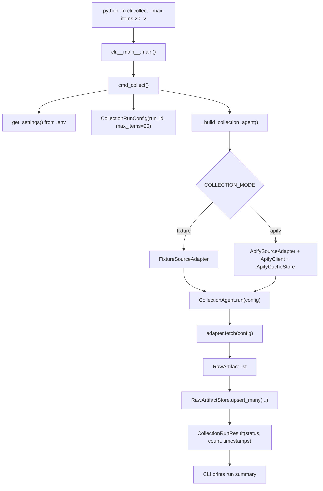

# Phase 1 — Collection

**Agent:** CollectionAgent  
**Maps to:** [architecture.md](../architecture.md) §3.1, §5 (SourceAdapter, raw store).

## Objective

Implement **CollectionAgent** and **RawArtifactStore** so collected (or fixture-loaded) items are persisted and addressable by **`run_id`**, with retries/backoff and compliance-safe adapters.

**Reality check:** Instagram-class targets are **rate-limited**, **anti-automated**, and **change often** (CAPTCHAs, blocking, DOM/API drift). Treat **fixtures/static seed datasets** as the default CI path. For live Phase 1 student runs, prefer **Apify** first: onboarding is usually simpler, free-tier credit refreshes monthly, and prebuilt Instagram Actors reduce setup overhead. **Instaloader** remains a fallback when license/API budget must be zero, but it carries higher ops risk.

For low-risk local iteration after a live Apify run, you can set `COLLECTION_MODE=apify_data` and read from a downloaded dataset JSON file (`APIFY_DATA_PATH`) instead of calling Apify again.

## Prerequisites

- [00_foundations.md](00_foundations.md) complete: config, fixtures, provenance schema skeleton.

**LangGraph:** `CollectionAgent` will be invoked from a **LangGraph** pipeline node in **Phase 4** ([04_graph_insertion.md](04_graph_insertion.md#langgraph-single-graph-phase-4)); keep the agent **free of orchestration imports** so the same code works from the future **HTTP API**.

## Deliverables (checklist)

> **Status:** baseline implementation is now in [`agents/collection/`](../src/agents/collection/) with fixture/apify adapters, SQLite `RawArtifactStore`, and `CollectionAgent`.

- [ ] Abstract **`SourceAdapter`** interface: `fetch(config) -> Iterable[RawArtifact]` (or async equivalent).
- [ ] **`FixtureSourceAdapter`**: reads from Phase 0 fixtures; used by default in dev/CI.
- [ ] **`CollectionAgent`**: orchestrates one run, assigns **collector_version**, attaches **run_id**, handles empty/partial results.
- [ ] **`RawArtifactStore`**: persist artifacts (SQLite or Parquet per architecture); query by `run_id`, `artifact_id`.
- [ ] Retry with backoff for transient errors (real adapter); explicit status on run (`completed`, `partial`, `failed`).
- [ ] Tests: collection run from fixtures produces N artifacts, all with required provenance fields.
- [ ] **`ApifySourceAdapter` (recommended live path):** call an Apify Instagram Actor/API behind `SourceAdapter`; token via env; respect credit budget and rate limits.
- [ ] **Apify request cache:** write/read request-keyed JSON envelopes under `apify_cache/` so repeated identical API calls are served from cache.
- [ ] **`InstaloaderSourceAdapter` (optional fallback):** local session-based collection with explicit safeguards (slow rate limits, retry/backoff, cookie hygiene, ban/captcha handling notes); same compliance bar as any live adapter.

**Target layout:** one primary class per file under `agents/collection/` ([requirement.md](../requirement.md) §2.1). Expose collection runs through the **HTTP API** when it exists; an optional **`collect`-style dev CLI** is only for local testing and should call the same service layer as the API.

## Implementation tasks

1. Finalize **RawArtifact** fields: `artifact_id`, `source_url`, platform ids, raw payload (text/JSON), `collected_at`, `run_id`, `collector_version`, adapter id.
2. Implement idempotent **artifact_id** (hash of platform id + run, or platform-stable id).
3. Log rate-limit and auth failures without leaking tokens.
4. Stub **`LiveInstagramAdapter`** (optional) behind feature flag, documented as **policy-dependent** — may no-op or raise “not configured” in CI.
5. When adding **Apify** / **Instaloader**: map responses into `RawArtifact`, surface **429**/**403**/empty-body as typed errors for backoff, and never log raw cookies or API tokens.

## Execution flow (`python -m cli collect --max-items 20 -v`)

Notes:
- **Fixture mode** is offline and CI-safe (no network/API call).
- **Apify mode** uses request-keyed cache under `APIFY_CACHE_DIR`; identical request payloads can be served from cache.
- Cache files are only written for non-empty, non-error responses.
- For **Apify mode**, pass at least one username: `--username nasa --username humansofny`.

## Apify student profile (recommended live path)

For classroom live collection, use Apify first:

- **Student-friendly onboarding:** often no credit card for starting usage.
- **Free monthly credit:** the platform commonly refreshes a small monthly credit budget (for example around **$5/month**).
- **Faster start:** prebuilt Instagram Actors reduce local scraping setup and maintenance.
- **Operational safety:** session/proxy orchestration is handled by the managed platform rather than your local machine.

Treat this as a low-volume teaching profile, not bulk scraping.

## Apify end-to-end setup (Phase 01)

Use this sequence for the Phase 01 live dry run.

### 1) Create Apify account and actor run profile

1. Create an Apify account and confirm current free-tier terms in the dashboard.
2. Create one API token dedicated to this project.
3. Choose a maintained Instagram Actor suitable for public-profile post collection.
4. Define conservative run input (small target list, small item limits).

### 2) Save credentials in local env (never commit)

Add placeholders to `.env` (or secret manager):

- `COLLECTION_MODE=apify`
- `COLLECTION_MODE=apify_data` (local file mode; no API call)
- `APIFY_API_TOKEN=...`
- `APIFY_ACTOR_ID=...`
- `APIFY_MAX_ITEMS_PER_RUN=...`
- `APIFY_CACHE_DIR=apify_cache`
- `APIFY_DATA_PATH=apify_data/input.json`
- `APIFY_RUN_TIMEOUT_SECONDS=300`
- `APIFY_POLL_INTERVAL_SECONDS=5`

### 3) Smoke-test one tiny actor run

Run a single actor execution with one public target and minimal output volume.

Success criteria:
- run reaches `SUCCEEDED` state
- result dataset contains expected post fields
- credits consumed are within your per-run budget

### 4) Wire `ApifySourceAdapter` to `CollectionAgent`

1. Implement `ApifySourceAdapter` behind `SourceAdapter`.
2. Keep fixture adapter as default for CI; use explicit config/flag for live mode.
3. Map actor output to `RawArtifact` with `run_id`, `collector_version`, and adapter id.
4. Persist to `RawArtifactStore`.

### 5) Enforce budget and safety gates

- Per-run item cap (small defaults for coursework).
- Maximum run duration and timeout.
- Fail as `partial` on repeated API errors or empty result sets for known-active targets.
- Log request/run metadata only (never tokens/secrets).

### 6) Validate end-to-end output

Check that the run:
- writes artifacts with non-empty `artifact_id` and `source_url`
- records run status (`completed` or `partial`) and typed errors when present
- remains within budget targets

## Data contracts

**Input:** run config (time window, max items, seed handles).  
**Output:** `RawArtifact` records persisted; each linked to **`run_id`**.

## Acceptance criteria

- Running collection against **FixtureSourceAdapter** fills the raw store; second run with same config is predictable per idempotency rules.
- No network required for default test suite.
- Architecture §3.1 failure modes handled: backoff, partial run persistence.

## Out of scope

- NER/RE, graph load, deduplication.

## Next phase

→ [02_extraction.md](02_extraction.md)
